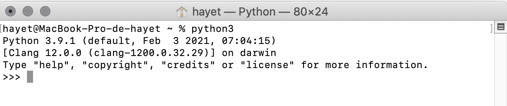
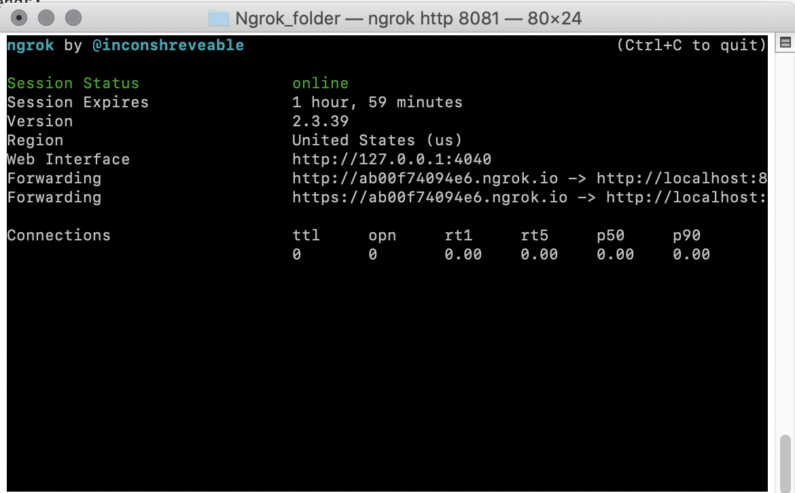

# Intro
During the start tutorial, we will need to use Python as a programming language, visual studio code to write code, and Ngrok to deploy webhook services in localhost.
## Install Python 3 
1. According to your os system, download and install Python from [Here](https://www.python.org/downloads/). Choose the latest version, i.e. "Download Python 3.9". 
2. To make sure that Python is installed successfully, run "python3" in the terminal (OS, Ubuntu) or in PowerShell (Windows).The result of this has to be like the following:

<p align="center">
  
</p>

## Install Visual Studio Code 
According to your os system, download and install Visual Studio Code from [Here](https://code.visualstudio.com/download). 

## Install Ngrok
Ngrok is a web tunneling tool that provides a way to test webhooks from a local server. Download it from here, unzip it, and in the terminal (OS, Ubuntu) or in PowerShell (Windows) just run the following commends:

```
cd Path_To_Ngrok
./ngrok http 8081 (or ngrok http 8081 if the first one does not work)

```

The result of this run has to be like the following:

<p align="center">
  
</p>

<b>Note.</b> Please note that a Ngrok session will still available only for 2 hours, so you have to rerun Ngrok each time these 2 hours expire.
